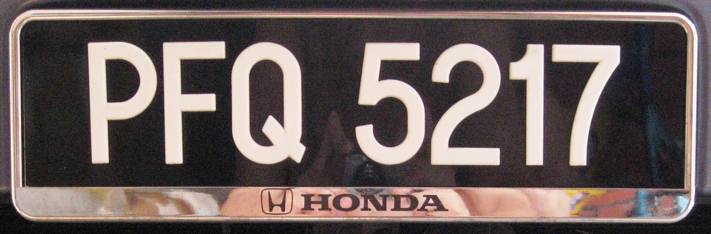
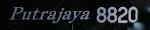
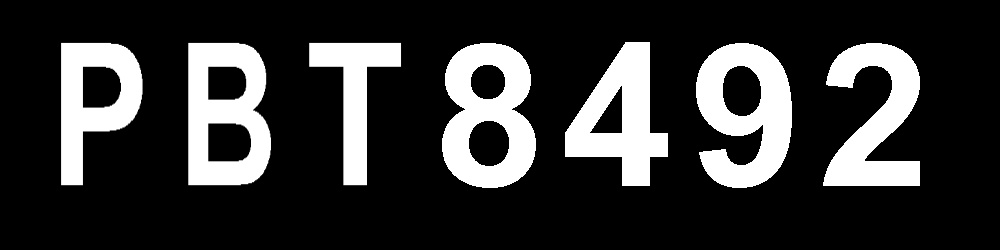
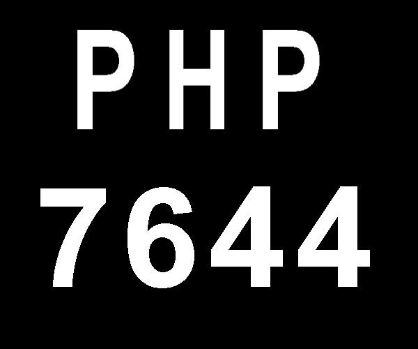

# Malaysia License Plate Generator
###
### This repository contains:
- Generate malaysia car plate for Automatic Car Plate Recognition training
- Create one line or two line car plate
- Augmentation for different rotations and lightining
<br />


###
# Malaysia License Plate

#### <p align='center'>Above is a common malaysia car plate</p>
<br />

### The Malaysia License Plate follows the "Sxx ####" **format**:
- 'S' is state prefix
- 'x' is the alphabetical sequences
- '#' is the number sequences
- The font type can be any easy to read typeface such as Arial Bold and Charles Wright
<br />

### However, there are several **exceptions** on the format where:
- No leading 0 in number sequences
- The alphabetical number, 'O' and 'I' is omitted due to similiar with number 0 and 1
- The alphabetical number, 'Z' is omitted to reserved for Malaysian military used 
<br />

### Commemorative Plates

- Commemorative plates have specific alphabetical sequences which ignore the standard format
- For example, Putrajaya series uses calisto italic font and start without following the standard format

### Total number characters 
#### There will be around 5 - 8 numbers for standard format 
<br />

# How to Use
```
    python3 main.py --total_plate 5
```
### Generate 5 fake car plate with default settings
```
    python3 main.py --help 
```
### Display help instructions and default settings in console
<br />

# Results
## Here are the results of the generator
### Single line

### Double line

<br />

# Reference
- https://en.wikipedia.org/wiki/Vehicle_registration_plates_of_Malaysia